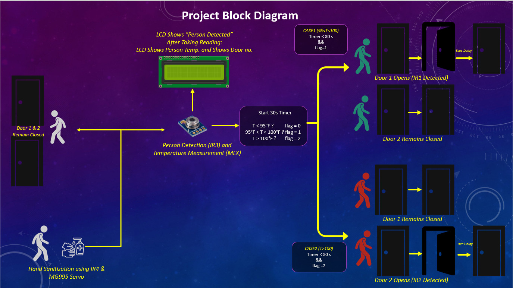
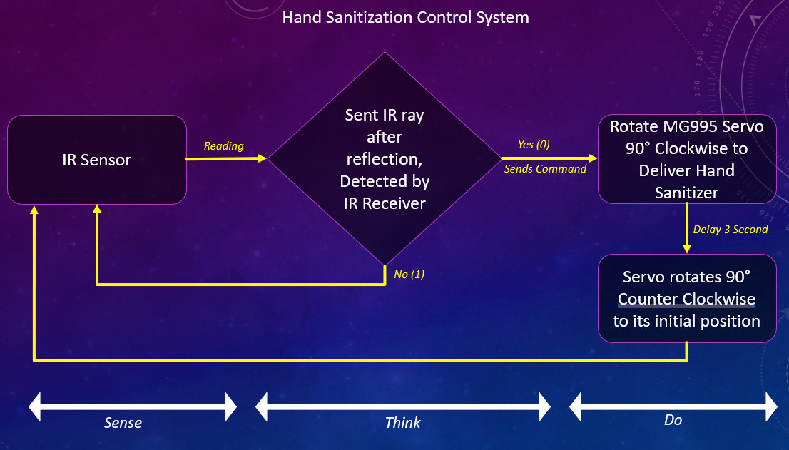
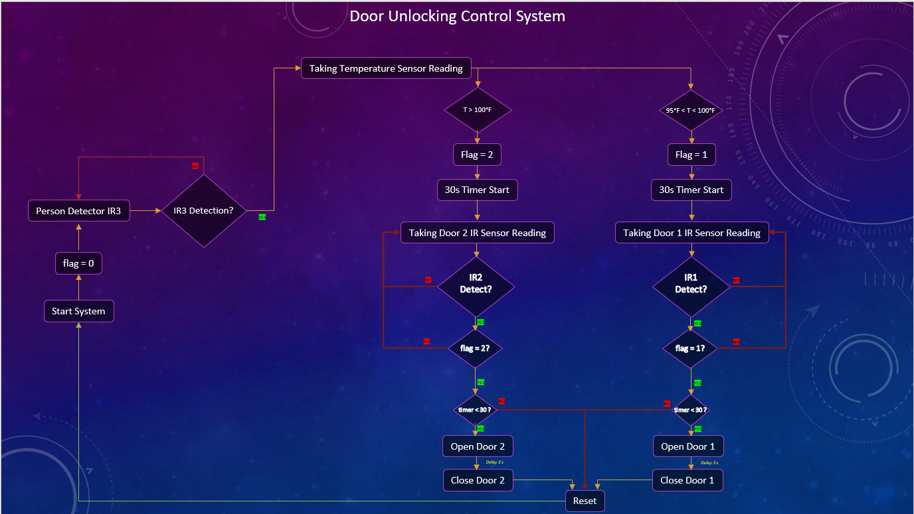
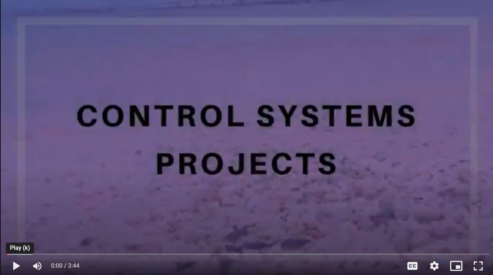

# Automatic-Hand-Sanitization-Booth-Temperature-Controlled-Door-Unlocking-System
Control System Project

## **Project Manifesto**
-   Ensure Hand Sanitization at Door Entrance
-   Checking Body Temperature and Output the Temperature in LCD
-   Take decision based on Temperature and Show Door Direction in LCD
-   Separate Healthy and Suspected Personnel Based on Body Temperature
-   Ensure that queue / serial is maintained when entering Door.

  

## **Components**
1. IR Sensor Module
2. IR temperature sensor ( MLX90614 )
3. Servo ( SG90, MG995)
4. Arduino Mega
5. LCD Display 1602
6. Bread Board
7. Jumpers

 

## **Project Workflow**
 

   

   

## **Control System**
 

   

   

## **Flow Chart**
 

   

   

## **Project Demo**

 

## **Contributors**
1. Md. Tasnim Azad
2. Samin Zawad
3. Mahadi Hassan
4. Kazi Moheuddin Alamgir
5. Md. Tanveer Aziz Durbar
